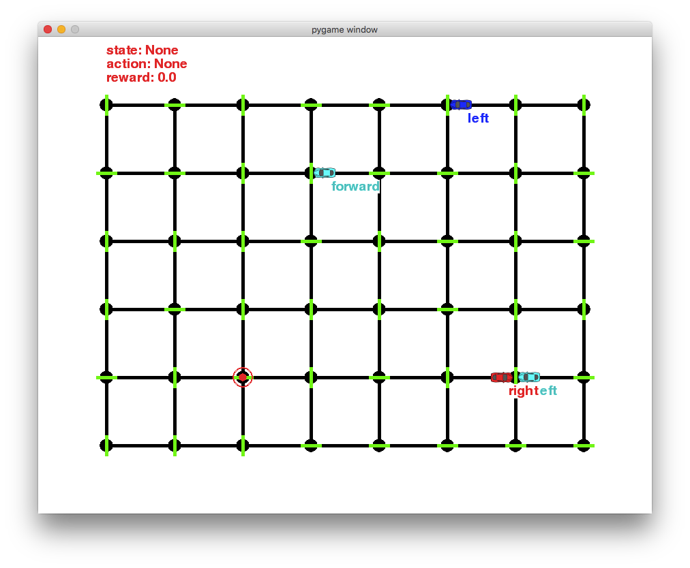

# Project 4: Reinforcement Learning
## Train a Smartcab How to Drive

## Run

In a terminal or command window, navigate to the top-level project directory `smartcab/` (that contains this README) and run one of the following commands:

```python smartcab/agent.py```  
```python -m smartcab.agent```

This will run the `agent.py` file and execute your agent code.

## Project Description

### Environment
The **smartcab** operates in an ideal, grid-like city (similar to New York City), with roads going in the North-South and East-West directions. Other vehicles will certainly be present on the road, but there will be no pedestrians to be concerned with. At each intersection there is a traffic light that either allows traffic in the North-South direction or the East-West direction. U.S. Right-of-Way rules apply:

- On a green light, a left turn is permitted if there is no oncoming traffic making a right turn or coming straight through the intersection.
- On a red light, a right turn is permitted if no oncoming traffic is approaching from your left through the intersection. To understand how to correctly yield to oncoming traffic when turning left, you may refer to this official drivers’ education video, or this passionate exposition.

### Inputs and Outputs
Assume that the **smartcab** is assigned a route plan based on the passengers’ starting location and destination. The route is split at each intersection into waypoints, and you may assume that the **smartcab**, at any instant, is at some intersection in the world. Therefore, the next waypoint to the destination, assuming the destination has not already been reached, is one intersection away in one direction (North, South, East, or West). The **smartcab** has only an egocentric view of the intersection it is at: It can determine the state of the traffic light for its direction of movement, and whether there is a vehicle at the intersection for each of the oncoming directions. For each action, the **smartcab** may either idle at the intersection, or drive to the next intersection to the left, right, or ahead of it. Finally, each trip has a time to reach the destination which decreases for each action taken (the passengers want to get there quickly). If the allotted time becomes zero before reaching the destination, the trip has failed.

### Rewards
The **smartcab** gets a reward for each successfully completed trip. A trip is considered “successfully completed” if the passenger is dropped off at the desired destination (some intersection) within a pre-specified time bound (computed with a route plan). It also gets a smaller reward for each correct move executed at an intersection. It gets a small penalty for an incorrect move, and a larger penalty for violating traffic rules and/or causing an accident.

### Goal
Design the AI driving agent for the **smartcab**. It should receive the above-mentioned inputs at each time step t, and generate an output move. Based on the rewards and penalties it gets, the agent should learn an optimal policy for driving on city roads, obeying traffic rules correctly, and trying to reach the destination within a goal time.

## Tasks

### Implement a basic driving agent
Implement the basic driving agent, which processes the following inputs at each time step:

* Next waypoint location, relative to its current location and heading,
* Intersection state (traffic light and presence of cars), and,
* Current deadline value (time steps remaining),
* And produces some random move/action (`None`, `'forward'`, `'left'`, `'right'`). Don’t try to implement the correct strategy! That’s exactly what your agent is supposed to learn.

Run this agent within the simulation environment with `enforce_deadline` set to `False` (see run function in `agent.py`), and observe how it performs. In this mode, the agent is given unlimited time to reach the destination. The current state, action taken by your agent and reward/penalty earned are shown in the simulator.

**Question:**

*Observe what you see with the agent's behavior as it takes random actions. Does the **smartcab** eventually make it to the destination? Are there any other interesting observations to note?*

**Answer:**

Before making any changes with the code, I ran the`agent.py` for a very long period. I found below things:

- Four **smartcab**s drive randomly along the grid. However, all of these **smartcab**s hardly go to the updated destination. They made every descions  (`None`, `'forward'`, `'left'`, `'right'`) randomly.

- The `red` **smartcab** ofter get stuck on the grid without following its current action of that point. 

- Two **smartcab**s could get stuck on the grid when they arrived the point at the same time no matter how the `TrafficLight` was. As below:

  

### Identify and update state
Identify a set of states that you think are appropriate for modeling the driving agent. The main source of state variables are current inputs, but not all of them may be worth representing. Also, you can choose to explicitly define states, or use some combination (vector) of inputs as an implicit state. At each time step, process the inputs and update the current state.

Run it again (and as often as you need) to observe how the reported state changes through the run.

**Question:**

*Justify why you picked these set of states, and how they model the agent and its environment.*

**Answer:**

I would choose the following four state variables:

- `next_waypoint = ['forward', 'left', 'right']`
  - With this variable, the **smartcab** is assigned with a target next step. It will move toward this destination.
- `light = ['red', 'green']`
  - In a real world, traffic light is apparently very important role. Driving throught a red light could result in a traffic violation, so it must be taken into account.
- `oncoming = [None, 'forward', 'left', 'right']`
  - Because the action of oncoming traffic would affact how the **smartcab** would move, I may have to consider the oncoming traffic.
- `left = [None, 'forward', 'left', 'right']`
  - The traffic from left will also affect the action of a **smartcab**. If the traffic from left was moving 'Forward', the **smartcab** cannot turn right when the light was 'red'.

With the variables above, the agent will have a set of 96 (3×2×4×4) states. At the same time, I decided to ignored `right` and `deadline` inputs. Because, in this environment setting, the traffic from 'right' doesn’t affect the action of a **smartcab** no matter when the light was 'red' or ‘green’. As each **smartcab** doesn't know its assigned destination, so `deadline` doesn't make a difference to limit how many step the **smartcab** left at the moment. 

### Implement Q-Learning
Implement the Q-Learning algorithm by initializing and updating a table/mapping of Q-values at each time step.
Now, instead of randomly selecting an action, pick the best action available from the current state based on Q-values, and return that.

Each action generates a corresponding numeric reward or penalty (which may be zero).
Your agent should take this into account when updating Q-values. Run it again, and observe the behavior.

**Question:**

*What changes do you notice in the agent’s behavior?*

**Answer:**

After fixed a bug in my last code, I got much greater results. The **smartcab** start to follow traffic rules in the environment. However, it gets repective positive or nagetive rewards as expected. Without put `deadline` into inputs, it could even drive all of the 100 agents to destinations!

```bash
Simulator.run(): Trial 99
Environment.reset(): Trial set up with start = (2, 4), destination = (7, 2), deadline = 35
RoutePlanner.route_to(): destination = (7, 2)
LearningAgent.update(): state = ('right', 'green', None, None), action = right, reward = 2.0, deadline = 35
LearningAgent.update(): state = ('right', 'red', 'left', None), action = None, reward = 0.0, deadline = 34
LearningAgent.update(): state = ('right', 'red', 'left', None), action = right, reward = 2.0, deadline = 33
LearningAgent.update(): state = ('forward', 'green', None, None), action = forward, reward = 2.0, deadline = 32
LearningAgent.update(): state = ('forward', 'red', None, None), action = None, reward = 0.0, deadline = 31
LearningAgent.update(): state = ('forward', 'red', None, None), action = None, reward = 0.0, deadline = 30
LearningAgent.update(): state = ('forward', 'red', None, None), action = None, reward = 0.0, deadline = 29
LearningAgent.update(): state = ('forward', 'red', None, None), action = None, reward = 0.0, deadline = 28
LearningAgent.update(): state = ('forward', 'green', None, None), action = forward, reward = 2.0, deadline = 27
LearningAgent.update(): state = ('forward', 'red', None, None), action = None, reward = 0.0, deadline = 26
LearningAgent.update(): state = ('forward', 'red', None, None), action = None, reward = 0.0, deadline = 25
LearningAgent.update(): state = ('forward', 'red', None, None), action = None, reward = 0.0, deadline = 24
LearningAgent.update(): state = ('forward', 'green', None, None), action = forward, reward = 2.0, deadline = 23
LearningAgent.update(): state = ('forward', 'red', None, None), action = None, reward = 0.0, deadline = 22
LearningAgent.update(): state = ('forward', 'red', None, None), action = None, reward = 0.0, deadline = 21
LearningAgent.update(): state = ('forward', 'green', None, None), action = forward, reward = 2.0, deadline = 20
LearningAgent.update(): state = ('left', 'red', None, None), action = None, reward = 0.0, deadline = 19
LearningAgent.update(): state = ('left', 'red', None, None), action = None, reward = 0.0, deadline = 18
Environment.act(): Primary agent has reached destination!
```

### Enhance the driving agent
Apply the reinforcement learning techniques you have learnt, and tweak the parameters (e.g. learning rate, discount factor, action selection method, etc.), to improve the performance of your agent. Your goal is to get it to a point so that within 100 trials, the agent is able to learn a feasible policy - i.e. reach the destination within the allotted time, with net reward remaining positive.

**Question:**

_Report what changes you made to your basic implementation of Q-Learning to achieve the final version of the agent. How well does it perform?_

**Answer:**

I tuned both the learning rate (alpha) and discount factor (gamma) from 0 to 1. I ran 100 runs in total. They all  sucessfully reached destination in 100 trials as long as alpha is greater than 0. In my final model, I will ultimately choose

```python
self.alpha = 0.5 # Learning rate
self.gamma = 0.5 # Discount factor
```


The learning rate alpha is the relative weight of new information the model acquired from the current state and action, while the weight of old information is (1-alpha). In the first column in the table above, it represents each run with alpha = 0, so the model couldn't gain information. That explains why the performances in this column are worse than others. That also tells me that, in this case, the new information much be enrolled into the Q-learning. I basically choose the midway - 0.5 - of alpha to balance the new information and old information, while alpha = 1 means the model would only consider the most recent information.

As for discount factor gamma, it determines weight of future Q-value. A gamma of 0 will make the model only consider the current rewards without looking forward to the future action. In this case, I will take the midway - 0.5 - of gamma to balance the weights of future (t+1) Q-value and current instant reward.


**Question:**

_Does your agent get close to finding an optimal policy, i.e. reach the destination in the minimum possible time, and not incur any penalties?_

The formulas for updating Q-values can be found in [this](https://www.udacity.com/course/viewer?&_ga=1.195155432.55316324.1459427136#!/c-ud728-nd/l-5446820041/m-634899057) video.

**Answer:**

I would consider an optimal policy with the most frequency to drive a **smartcab** to the assgined destination.

After observe the **smartcab** behavior on the UI and the Q-table of last few trials. I found that the agent is able to reach the current destination. It will be assigned a negative reward when it breaks the traffic rules. So I think the agent could learn to get close to an optimal policy. 

For example, the follow is the Terminal outputs for the last trial. After several iterations, my primary agent eventually reached destination. And it updates the Q-table with `state = ('forward', 'green', None, None), action = forward, reward = 12.0`. 

In the middle part, I highlighted an iteration which the agent broke the traffic rule and got a negative reward to update. It means that the agent should be heading to left, however, the traffic light was right and the oncoming traffic was heading left. The correct action was apparently just to stay at the stopping line till the traffic light turn to green. Unfortunatley, the agent went forward through the intersection. So it received a ticket (negative reward) for this wrong action.

> Simulator.run(): Trial 99
> Environment.reset(): Trial set up with start = (4, 1), destination = (3, 4), deadline = 20
> RoutePlanner.route_to(): destination = (3, 4)
> LearningAgent.update(): state = ('forward', 'green', None, None), action = forward, reward = 2.0, deadline = 20
> LearningAgent.update(): state = ('left', 'red', None, None), action = None, reward = 0.0, deadline = 19
> LearningAgent.update(): state = ('left', 'red', None, None), action = None, reward = 0.0, deadline = 18
> LearningAgent.update(): state = ('left', 'red', None, None), action = None, reward = 0.0, deadline = 17
> <u>**LearningAgent.update(): state = ('left', 'red', 'left', None), action = forward, reward = -1.0, deadline = 16**</u>
> LearningAgent.update(): state = ('left', 'green', None, None), action = left, reward = 2.0, deadline = 15
> LearningAgent.update(): state = ('forward', 'red', None, None), action = None, reward = 0.0, deadline = 14
> LearningAgent.update(): state = ('forward', 'red', None, None), action = None, reward = 0.0, deadline = 13
> LearningAgent.update(): state = ('forward', 'green', None, None), action = forward, reward = 2.0, deadline = 12
> <u>**Environment.act(): Primary agent has reached destination!**</u>
> LearningAgent.update(): state = ('forward', 'green', None, None), action = forward, reward = 12.0, deadline = 11